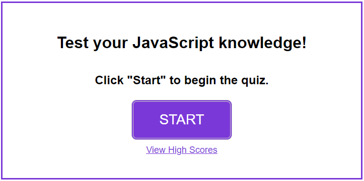
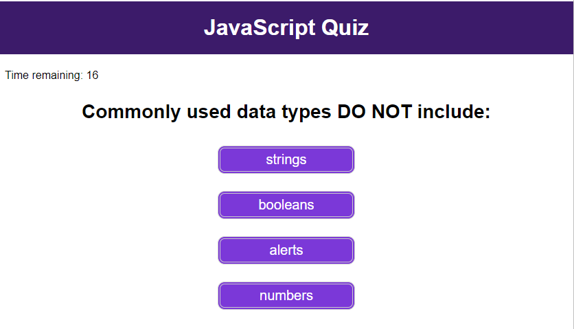
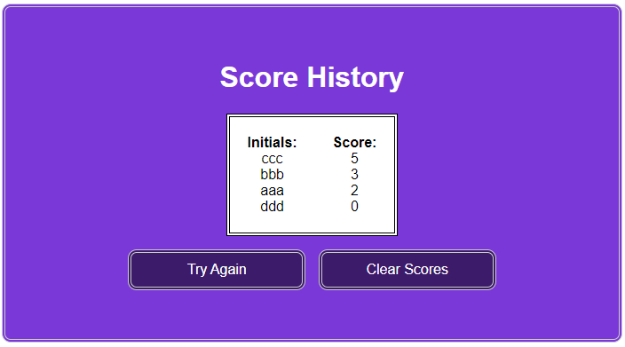

# challenge-4-code-quiz
JavaScript program to help practice timed quiz on coding principles

## User Story
AS A coding boot camp student  
I WANT to take a timed quiz on JavaScript fundamentals that stores high scores  
SO THAT I can gauge my progress compared to my peers  

## Acceptance Criteria
GIVEN I am taking a code quiz  
WHEN I click the start button  
THEN a timer starts and I am presented with a question  
WHEN I answer a question  
THEN I am presented with another question  
WHEN I answer a question incorrectly  
THEN time is subtracted from the clock  
WHEN all questions are answered or the timer reaches 0  
THEN the game is over  
WHEN the game is over  
THEN I can save my initials and score  

## Description of Work Performed
Wrote HTML, JavaScript, and CSS files from scratch to generate the following:
* A splash page that lists the name of the quiz and a clickable "Start" button
* User can click to view high scores from the start screen
* Once the "Start" button is clicked:
  * The first quiz question loads and a 30 second countdown timer begins
  * Once the user selects a clickable answer button, the next question begins
  * If the user chose an incorrect answer, 5 seconds is subtracted from the countdown timer
  * If time runs out before the final question is answered, the quiz ends and the user is prompted for their initials to save their score
  * If the user answers all questions, they are prompted to input their initials to save their score
* Once the quiz ends, the user is shown a page that displays all previous initials and scores
* Buttons on the score history page allow the user to restart the quiz or clear previously saved scores

## Link to deployed GitHub page
[Deployed Challenge 4 Code Quiz Repo](https://abmetheny.github.io/challenge-4-code-quiz/)

## Screenshots

## License
This project is licensed under the MIT License - see the LICENSE.md file for details.